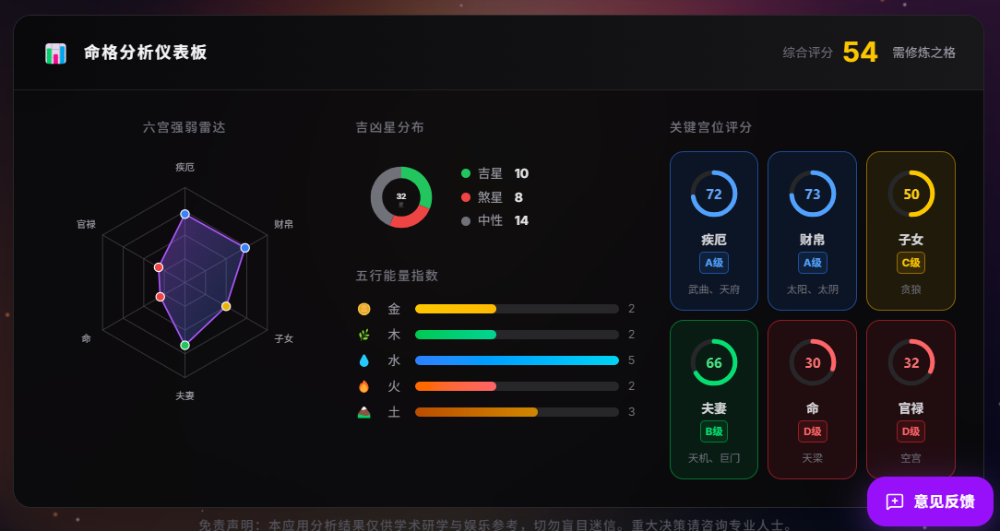
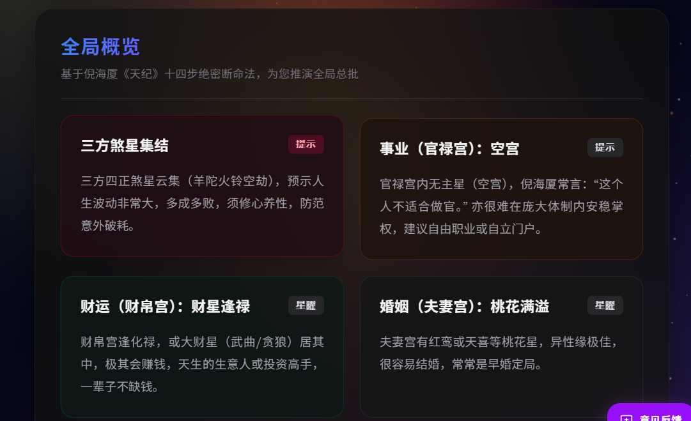
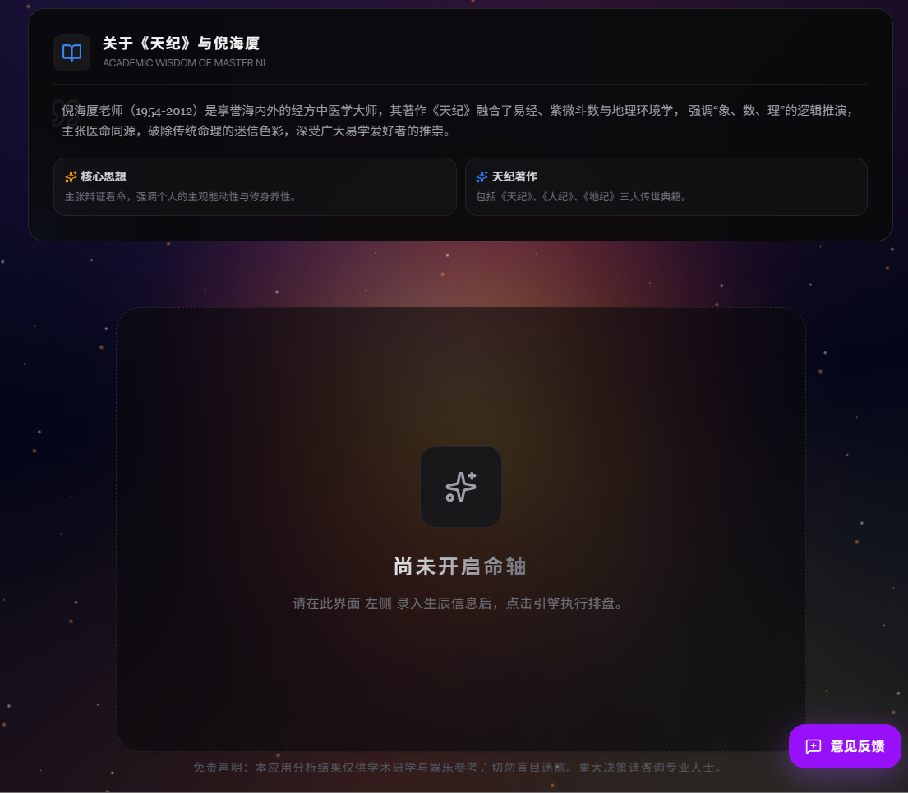
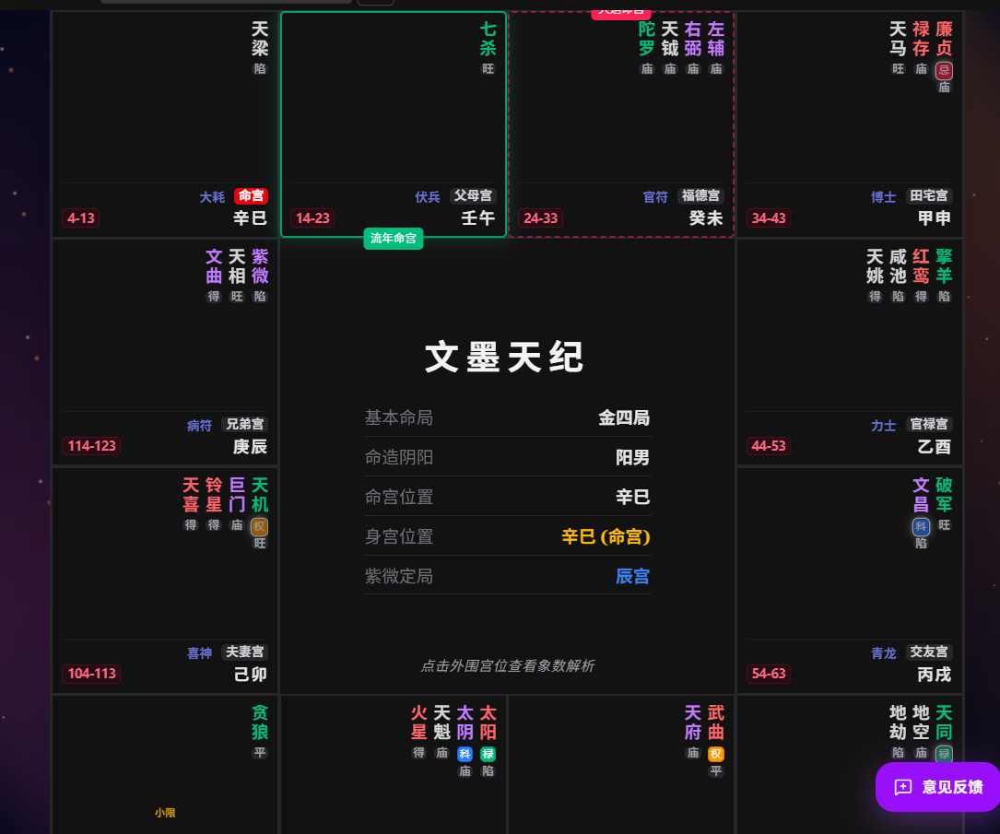
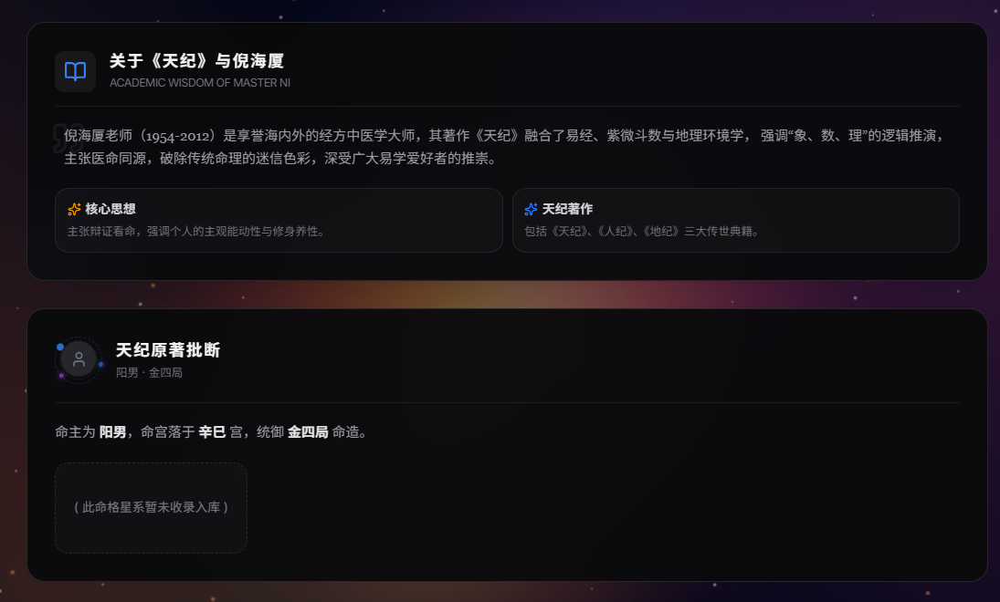
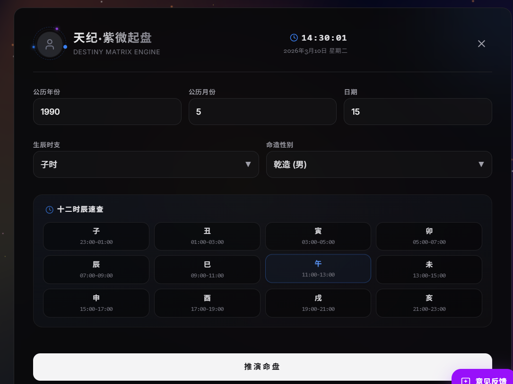

# 天纪·紫微起盘 (Ziwei Destiny Engine)

[](https://opensource.org/licenses/MIT)
[](https://nextjs.org/)
[](https://fastapi.tiangolo.com/)
[](https://www.docker.com/)
[](https://ziweidoushu.nlsxh.top/)

> **🚀 在线体验地址：[https://ziweidoushu.nlsxh.top/](https://ziweidoushu.nlsxh.top/)**

> “医命同源，象数理推。” —— 传承倪海厦老师《天纪》精髓，打造现代科技与传统命理融合的先行者。

## 🌟 项目简介

本项目是一款基于 **倪海厦老师《天纪》** 理论设计的紫微斗数排盘与智能分析系统。它摒弃了传统命理的迷信色彩，以“象、数、理”为核心，通过现代化的全栈技术栈，为易学爱好者提供一个专业、严谨且高颜值的推演工具。

### ✨ 核心特性

- 🎨 **大厂级 UI/UX**：采用 Dark Mode 宇宙星空主题，响应式设计，极致的视觉体验。
- 🔮 **严谨排盘逻辑**：深度还原《天纪》排盘规则，支持十二宫位、星系排列及四化分析。
- 🤖 **大师级解盘**：集成了倪海厦老师的原著批断逻辑，提供结构化的 API 洞见支撑。
- ⚡ **高性能架构**：FastAPI 后端驱动，Next.js 前端渲染，支持 Docker 一键部署。
- 🛡️ **开源合规**：内置详尽的免责声明与学术指引。

## 🖼️ 界面展示 (UI Showcase)

<table align="center">
  <tr>
    <td align="center"><br/><b>🌌 信息汇总</b></td>
    <td align="center"><br/><b>🤖 大师批断洞见</b></td>
  </tr>
  <tr>
    <td align="center"><br/><b>🔮 未排盘</b></td>
    <td align="center"><br/><b>🔍 专业十二宫排盘</b></td>
  </tr>
  <tr>
    <td align="center"><br/><b>详情介绍</b></td>
    <td align="center"><br/><b>📝 排盘信息输入</b></td>
  </tr>
  <tr>
</table>

---

---

## 🛠️ 技术栈

### 前端 (Frontend)
- **Framework**: Next.js 14 (App Router)
- **Styling**: Tailwind CSS
- **Components**: Radix UI / Lucide React
- **State**: React Hooks & Context

### 后端 (Backend)
- **Language**: Python 3.11+
- **Framework**: FastAPI
- **Engine**: 自研紫微排盘核心算法库
- **Server**: Uvicorn

### 基础设施
- **Deployment**: Docker & Docker Compose
- **Proxy**: Nginx / 1Panel / OpenResty

---

## 🚀 快速开始

### 1. 克隆项目
```bash
git clone https://github.com/Jeffery518/Ziweidoushu.git
cd Ziweidoushu
```

### 2. 环境配置
复制环境变量模板：
```bash
cp .env.example .env
```

### 3. Docker 一键启动
确保你已安装 Docker 和 Docker Compose，然后在根目录执行：
```bash
docker compose up -d --build
```
- 前端访问：`http://localhost:3000`
- 后端 API：`http://localhost:8000`

---

## 📂 目录结构

```text
├── frontend/             # Next.js 前端源码
├── backend/              # FastAPI 后端源码
├── docker-compose.yml    # 容器编排配置
├── .env.example          # 环境变量模板
└── README.md             # 项目说明文档
```

---

## 📜 免责声明

本应用生成的分析结果仅供**学术研究与娱乐参考**，不代表任何形式的绝对预言。命理推演强调主观能动性，重在修身养性与把握先机。涉及重大的人生决策（医疗、法律、投资等），请务必咨询相关领域的持证专业人士。

## 🧧 赞赏支持 (Support)

如果您觉得这个项目对您有所帮助，欢迎请作者喝杯咖啡，您的支持是我持续更新的动力！

<div align="center">
  
  <p><b>使用支付宝扫码支持</b></p>
</div>

---

## 🤝 贡献与反馈

欢迎提交 Issue 或 Pull Request。如果你觉得这个项目对你有帮助，请给一个 **Star** 🌟，这是对开发者最大的支持！

## 📄 开源协议

本项目基于 [MIT License](LICENSE) 协议开源。

---

> **致敬倪海厦老师**：希望通过科技的力量，让更多人领略到中式传统文化的逻辑美学与智慧。
